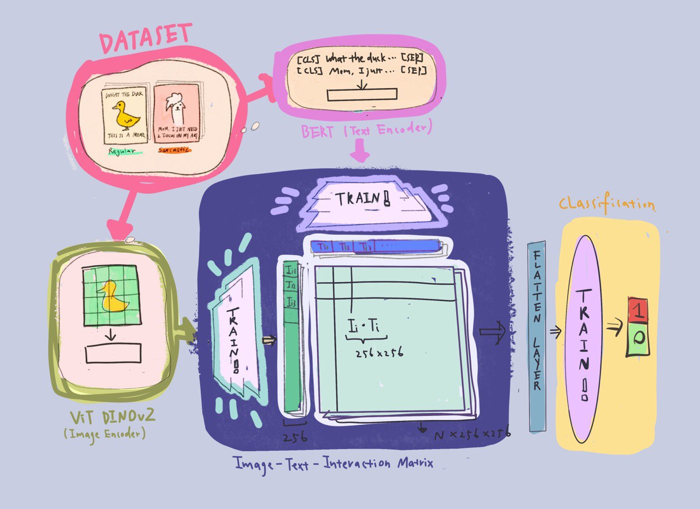
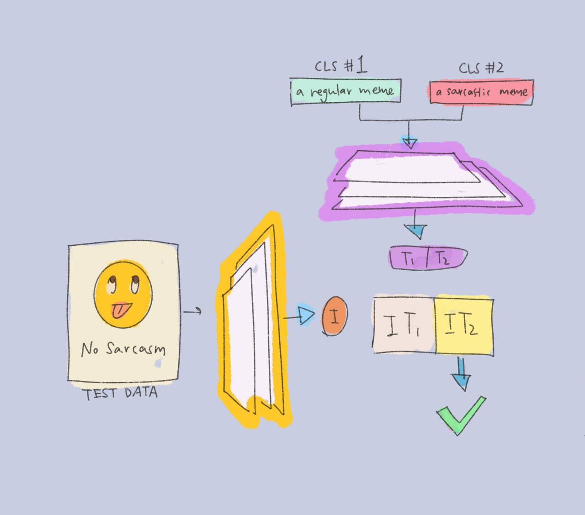

# Exploring MEMEs using constractive learning

<b> This repository provides a simplified implementation of a variation of <a href="https://openai.com/index/clip/">CLIP by OPEN AI</a> with Gensim Doc2Vec/Hugging Face DistilledBERT and Facebook DINOv2/Google AI EfficientNet as the text and image encoders, respectively.</b>

The repository also includes notebooks for training the models to fullfill the following tasks.

Objective 1： Read the sarcasm! Is this meme <b> sarcastic </b> or not? -- A classifier

Objective 2: Build a ranking system for <b> MEMES </b>

# Methodology

Here is a flow chart drawn by an awesome artist. (ME.)

 

The training phase:

The classification:

 

# Dataset

We used the <a href ='https://www.kaggle.com/datasets/williamscott701/memotion-dataset-7k'> MEMOTION DATASET 7K </a> as our training and testing dataset. 

Dataset Class: Datasets/MemeDataset.py

Features: Images and Captions.

<b>Dataset characterization </b>

- Training set size: 7000

- Text format: cvs file

- Image format: jpg

- Testing set size: 2000

- Text Preprocessing: strip all special characters, watermarks, dates, and stop words. Lemmatization.

- Image Preprocessing: file corruption, re-size

  
Three classes are included in MemeDatasets.py:

# Exploratory Data Analysis

# Structure of the repository

*The implementation of clip model is in the "custom_models" folder. *

*The trainer module "CLIP_trainer.py" and training note of the model is in the root folder.*

*The Datasets folder includes a sample of images and texts and the Dataset class in CLIP_Datasets.py*
